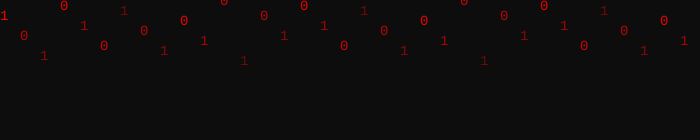

<div align="center">  </div> <br/> <div align="center">

[](https://git.io/typing-svg)

  

</div> <br/>

## `./overview`

Домашний полигон для отработки атаки и защиты. Три виртуальные машины на UTM, изолированная сеть, без выхода наружу. Атакующая сторона — Kali. Цель — Metasploitable. Защитная сторона — отдельная VM, собирает логи и позже получит правила блокировки

<br/>

## `./architecture`

```
[Ubuntu-server] ───┐
		           ├── Host Only 192.168.100.0/24 ── [Kali]
[Metasploitable] ──┘  
```

|VM|роль|IP|ресурсы|
|---|---|---|---|
|Kali Linux|атака|192.168.100.10|8 GB RAM, 4 CPU|
|Metasploitable 2|цель|192.168.100.20|1 GB RAM, 1 CPU|
|ubuntu-defender|защита|192.168.100.30|2 GB RAM, 2 CPU|

<br/>

## `./labs`

| №   | writeup                                                                 | статус | техники                         |
| --- | ----------------------------------------------------------------------- | ------ | ------------------------------- |
| 01  | [Дело "О настройке системы"](./SystemSetup/README.md) | Complite      | UTM, network isolation, rsyslog |

<br/>

## `./stack`

   

<br/> <div align="center">

[](https://git.io/typing-svg)

</div>
